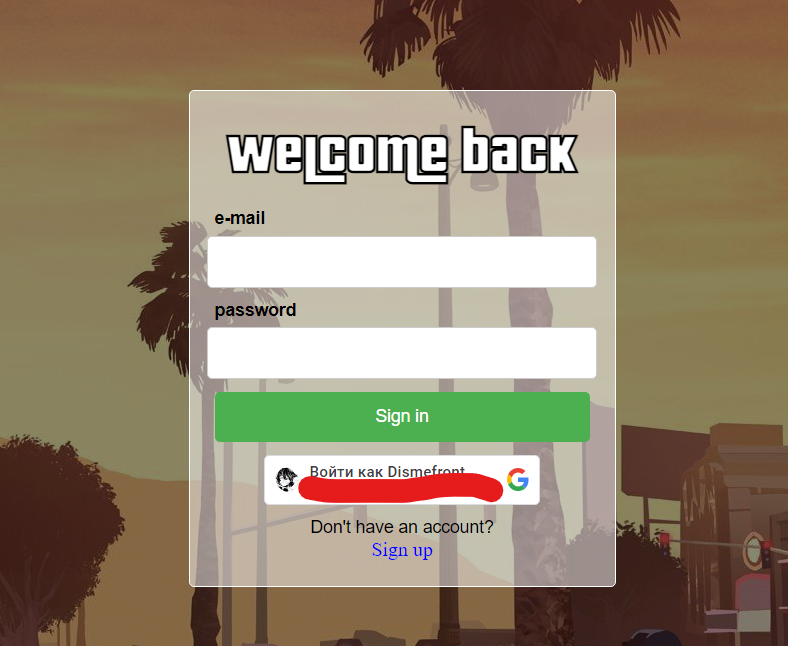
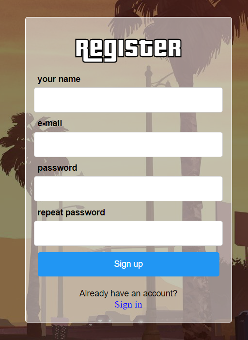
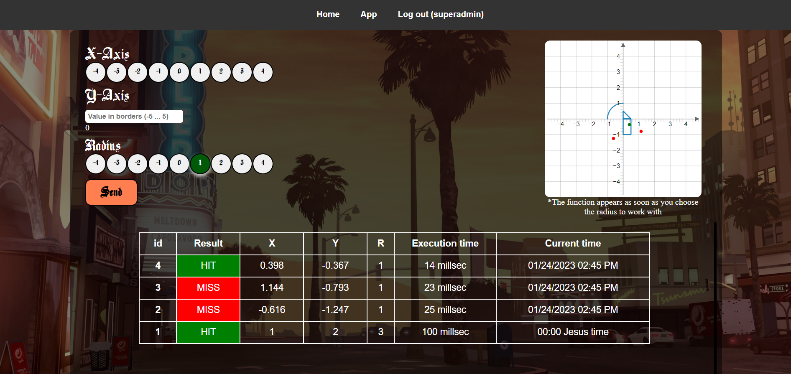
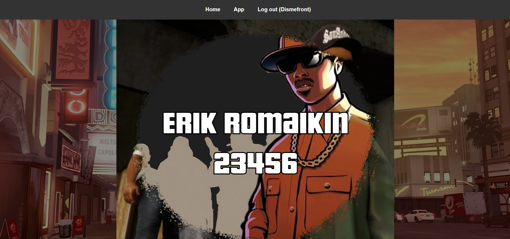

# web4
## Summary
The application detects if the points hit the selected area, using the stack of React(frontend), and Spring(Backend). 
Works with Node.js 16.12.0 
Important: Does not work with Node 17+ 
## Functionality Screenshots
 
 
 
 
